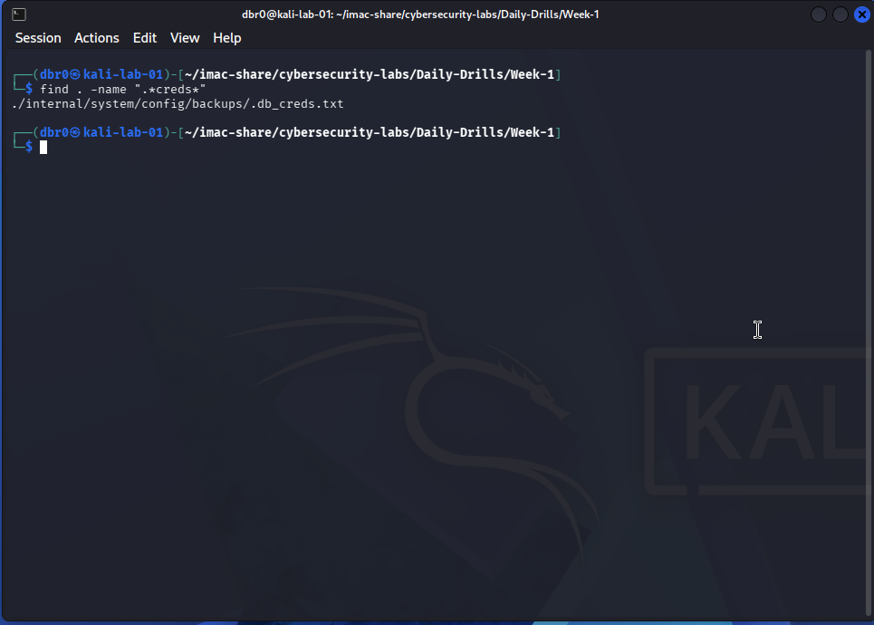
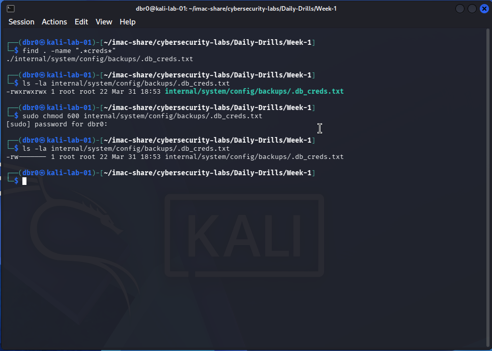
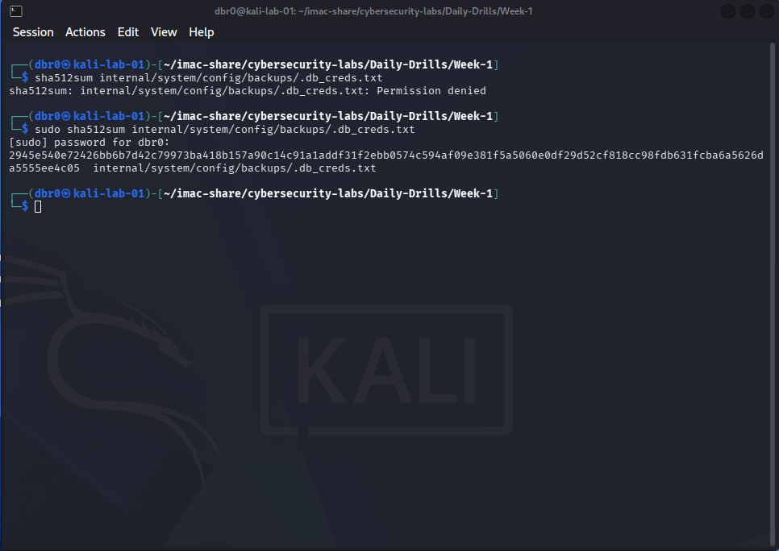

# Day 01: Forensic Sweep & System Hardening 🛡️

**Date:** March 31, 2026
**Role:** Security Analyst (Defensive)
**Objective:** Locate hidden sensitive data and apply the Principle of Least Privilege.

---

## 🔍 Phase 1: Discovery (The Hunt)
I performed a recursive search from the root of the lab directory to identify hidden files that may contain sensitive credentials.

- **Command used:** `find . -name ".*creds*"`
- **Result:** Located a hidden file at `./internal/system/config/backups/.db_creds.txt`.

---

## 🛠️ Phase 2: Audit & Remediation (The Lockdown)
Upon discovery, I audited the file permissions and identified a **Critical Security Risk**. The file was set to `777` (World Readable/Writable/Executable).

1. **Initial State:** `-rwxrwxrwx` (Any user can read/modify/delete).
2. **Action:** Applied `chmod 600` to restrict access to the **Owner (root)** only.
3. **Hardened State:** `-rw-------` (No access for Group or Others).

---

## 🔐 Phase 3: Integrity Validation (The Fingerprint)
To ensure the file remains untampered, I generated a SHA512 cryptographic hash. This serves as a digital fingerprint for future audits.

- **Command:** `sudo sha512sum internal/system/config/backups/.db_creds.txt`
- **SHA512 Hash:** `2945e540e72426bb6b7d42c79973ba418b157a90c14c91a1addf31f2ebb0574c594af09e381f5a5060e0df29d52cf818cc98fdb631fcba6a5626da5555ee4c05`

---

## 💡 Key Takeaways
- **Least Privilege:** Data files should never have "Execute" permissions (600 vs 700).
- **Control Validation:** Attempting to read the file as a standard user after hardening resulted in `Permission denied`, confirming the control is effective.