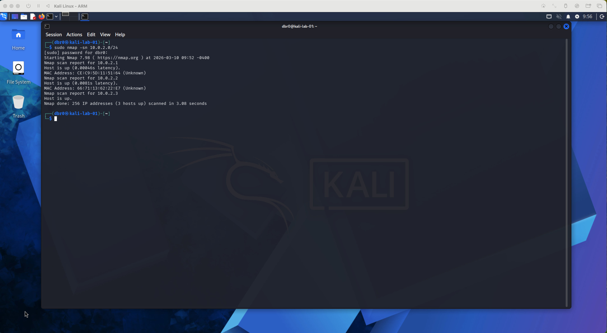
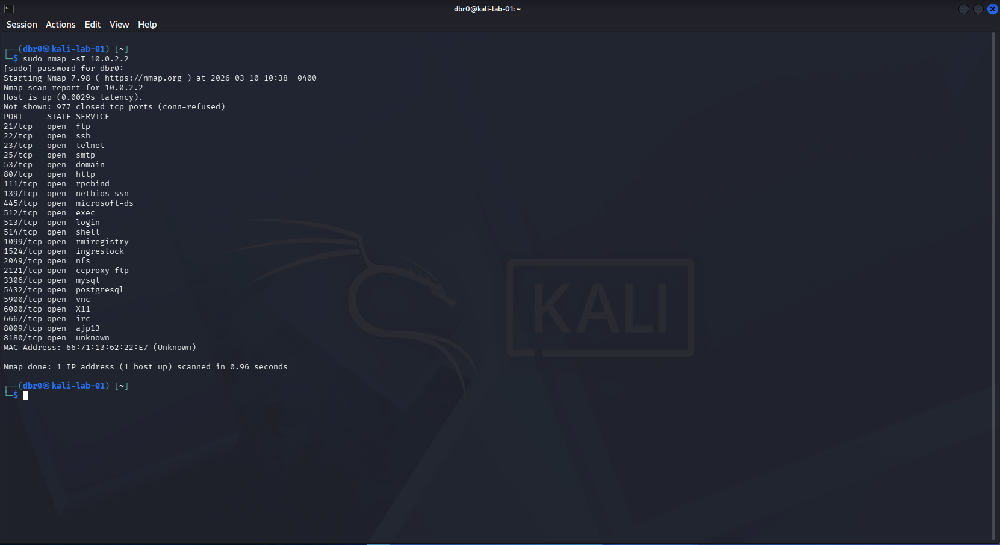
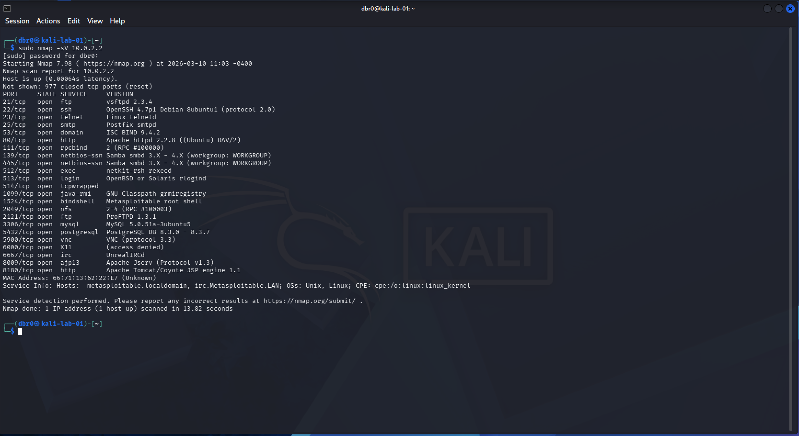
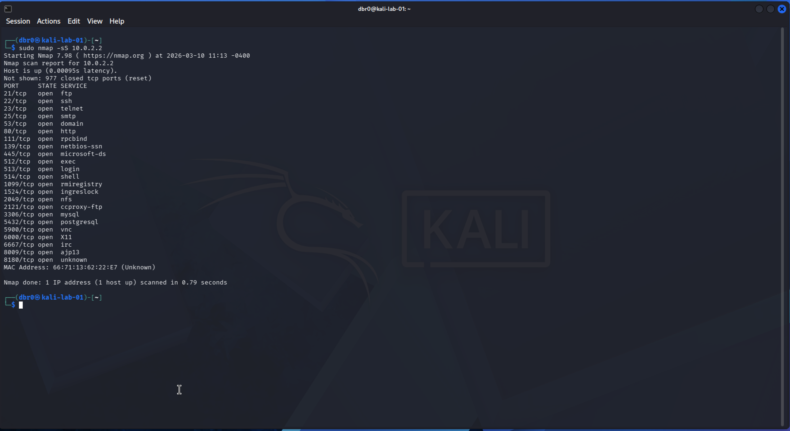
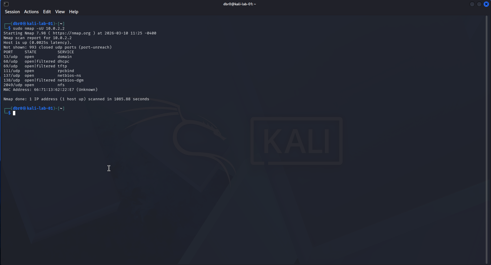
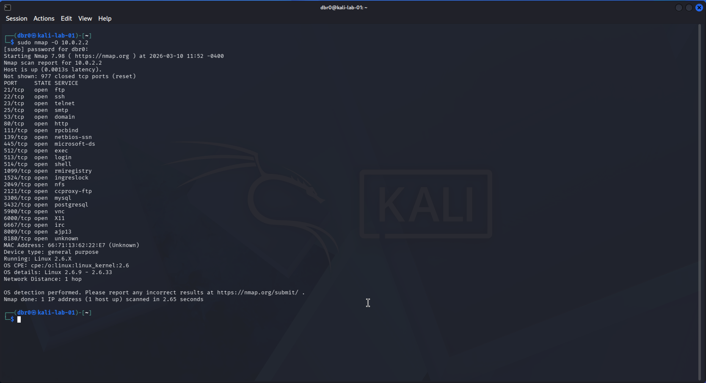

# Nmap Network Scanning Lab

## Objective

The goal of this lab is to perform network reconnaissance using Nmap and understand how attackers and security professionals identify exposed services on a network.

Nmap is used to:

- discover active hosts
- identify open ports
- detect running services
- fingerprint operating systems
- enumerate potential attack surfaces

Skills demonstrated:

• host discovery  
• TCP port scanning  
• SYN stealth scanning  
• UDP scanning  
• service version detection  
• OS fingerprinting  
• aggressive enumeration  

Source:  
https://nmap.org/book/man.html

---

# Lab Environment

## Attacker Machine

Kali Linux  
Hostname: `kali-lab-01`  
User: `dbr0`

## Target Machine

Metasploitable2 (intentionally vulnerable Linux VM)

## Network Type

Internal NAT lab network

Example Target IP:
10.0.2.X

Actual target used during the lab:
10.0.2.2

---

# Tools Used

• Nmap  
• Netcat  
• arp-scan  
• netdiscover  

Primary tool used for enumeration:
Nmap

Official documentation:

https://nmap.org/book/man.html

---

# Reconnaissance Workflow

The following methodology was used to enumerate the target machine.

1. Discover active hosts on the network
2. Perform a basic TCP port scan
3. Identify service versions
4. Perform a SYN stealth scan
5. Perform a UDP scan
6. Detect the operating system
7. Perform full enumeration using an aggressive scan

Commands executed:
nmap -sn 10.0.2.0/24
nmap -sT 10.0.2.2
nmap -sV 10.0.2.2
nmap -sS 10.0.2.2
nmap -sU 10.0.2.2
nmap -O 10.0.2.2
nmap -A 10.0.2.2

This workflow mirrors reconnaissance stages used during penetration testing engagements.

Source:  
https://www.pentest-standard.org/index.php/PTES_Technical_Guidelines

---

# Host Discovery

To identify active hosts on the network, a ping scan was performed.

Command:
sudo nmap -sn 10.0.2.0/24

Explanation:

`-sn` performs host discovery without performing port scanning.

`/24` scans the entire subnet.

Result:

Three hosts were discovered.
10.0.2.1 – NAT gateway
10.0.2.2 – Metasploitable2 target
10.0.2.3 – Kali attacker machine

Screenshot:

Source:  
https://nmap.org/book/host-discovery.html

---

# Basic TCP Port Scan

After identifying the target host, a TCP connect scan was performed.

Command:
sudo nmap -sT 10.0.2.2

Explanation:

`-sT` performs a TCP connect scan by completing the full TCP handshake.

Result:

Multiple open services were discovered.

Examples:
21/tcp – ftp
22/tcp – ssh
23/tcp – telnet
25/tcp – smtp
80/tcp – http
139/tcp – netbios
445/tcp – smb
3306/tcp – mysql
5432/tcp – postgresql

Screenshot:

Source:  
https://nmap.org/book/man-port-scanning-techniques.html

---

# Service Version Detection

Next, service version detection was performed.

Command:
sudo nmap -sV 10.0.2.2

Explanation:

`-sV` probes open ports to identify the service version running on the target.

This helps identify potential vulnerabilities associated with outdated software.

Screenshot:

Source:  
https://nmap.org/book/man-version-detection.html

---

# SYN Stealth Scan

A SYN stealth scan was performed.

Command:
sudo nmap -sS 10.0.2.2

Explanation:

`-sS` performs a SYN scan without completing the full TCP handshake.

This technique is often referred to as a **half-open scan**.

Benefits:

• faster than TCP connect scans  
• more stealthy  
• commonly used during penetration testing

Screenshot:

Source:  
https://nmap.org/book/synscan.html

---

# UDP Scan

A UDP scan was performed to identify UDP-based services.

Command:
sudo nmap -sU 10.0.2.2

UDP scans are significantly slower because many UDP services do not respond to probes.

Results included services such as:
53/udp – DNS
68/udp – DHCP
69/udp – TFTP
111/udp – RPC
137/udp – NetBIOS
2049/udp – NFS

Screenshot:

Source:  
https://nmap.org/book/udp-scan.html

---

# OS Detection

Operating system detection was performed.

Command:
sudo nmap -O 10.0.2.2

Nmap analyzes TCP/IP stack behavior to fingerprint the operating system.

Result:
Linux 2.6.x kernel

This matches the expected OS for Metasploitable2.

Screenshot:

Source:  
https://nmap.org/book/osdetect.html

---

# Aggressive Enumeration Scan

A final aggressive scan was performed to gather additional information.

Command:
sudo nmap -A 10.0.2.2

The `-A` flag enables:

• OS detection  
• service version detection  
• script scanning  
• traceroute  

Screenshot:

Full scan output stored in:
scan-results/aggressive_scan.txt

Source:  
https://nmap.org/book/man-misc-options.html

---

# Findings Summary

The Metasploitable2 system exposes a large number of services.

Key services discovered:

| Port | Service | Description |
|-----|------|------|
| 21 | FTP | File transfer service |
| 22 | SSH | Secure remote access |
| 23 | Telnet | Insecure remote terminal |
| 25 | SMTP | Mail transfer |
| 80 | HTTP | Web server |
| 139 | NetBIOS | Windows file sharing |
| 445 | SMB | Windows file sharing |
| 3306 | MySQL | Database server |
| 5432 | PostgreSQL | Database server |
| 5900 | VNC | Remote desktop |

These services significantly increase the attack surface of the target machine.

---

# Screenshots

All scan evidence is stored in:
screenshots/

Full enumeration output:
scan-results/aggressive_scan.txt

---

# Lessons Learned

Key takeaways from this lab:

• Nmap provides powerful capabilities for network reconnaissance  
• Different scan techniques reveal different information  
• UDP scans are slower due to lack of response behavior  
• OS fingerprinting can help identify target operating systems  
• Aggressive scans combine multiple enumeration techniques  

Understanding how to properly interpret scan results is a fundamental skill for penetration testers and security analysts.
